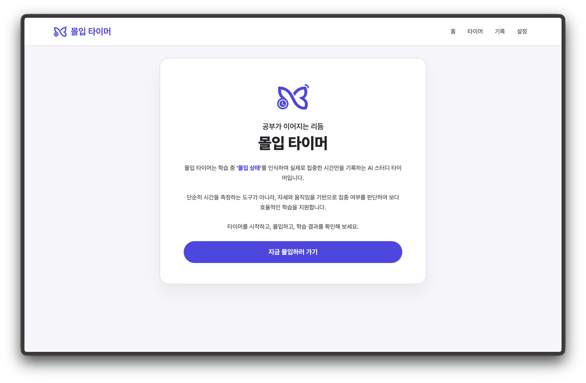
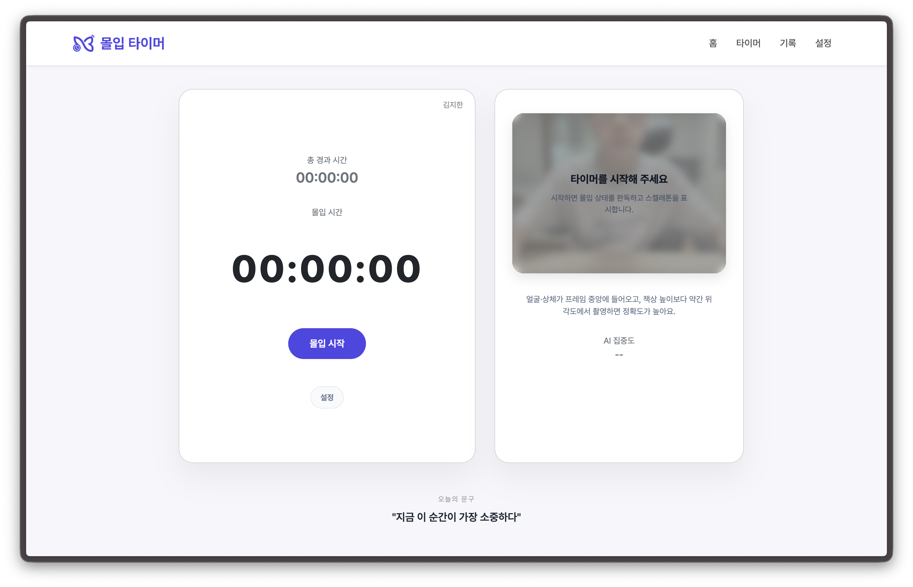
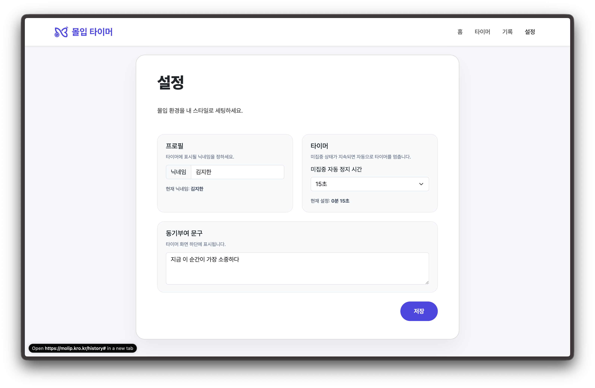
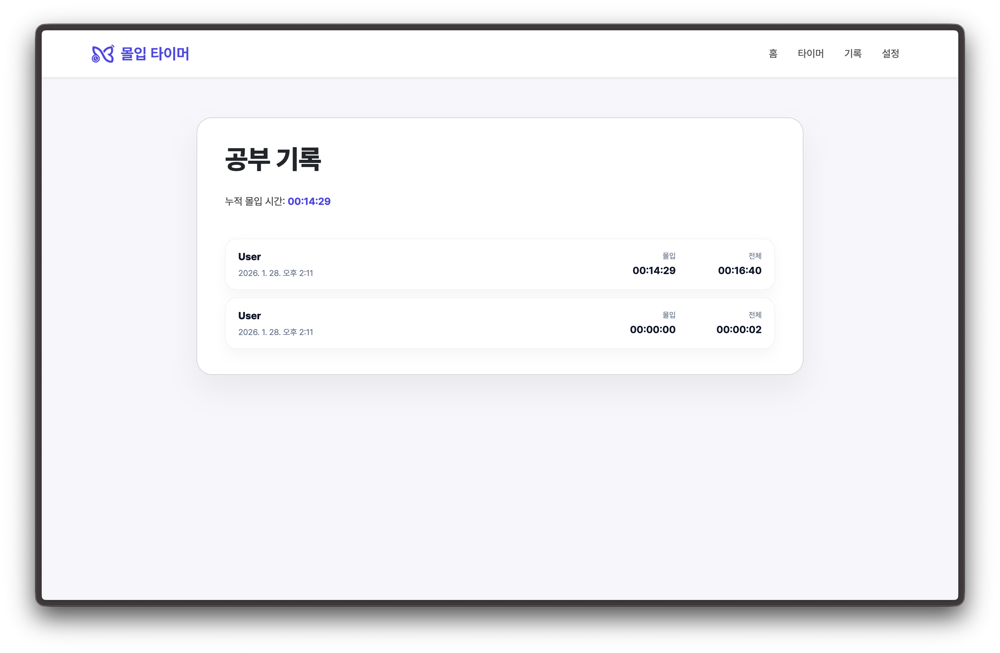

<div align="center">

  # Molip Timer

  
  <br />

  공부 자세를 판독해 **몰입 시간만 따로 집계**하는 AI 기반 집중 타이머

  <a href="https://molip.kro.kr" target="_blank">
    
  </a>

  <br />
  
  
  
  
  
</div>


## ✨ 주요 특징

- **몰입 시간 / 총 시간 분리 집계**: 실제 집중 구간만 따로 누적
- **웹캠 포즈 판독**: 스켈레톤 오버레이로 즉시 피드백
- **미집중 자동 정지**: 카운트다운 후 타이머 일시정지
- **즉각적인 UI 피드백**: 상태 색상, 알림, 닉네임/문구 표시
- **사용자 맞춤 설정**: 자동 정지 시간, 닉네임, 동기부여 문구 저장

<br>

## 🖼️ 화면 캡처

<table align="center">
  <tr>
    <td align="center">
      <br />
      홈
    </td>
    <td align="center">
      <br />
      타이머
    </td>
  </tr>
  <tr>
    <td align="center">
      <br />
      설정
    </td>
    <td align="center">
      <br />
      히스토리
    </td>
  </tr>
</table>

<br>

## 🧠 어떻게 동작하나요

1. **웹캠 입력** → `@teachablemachine/pose`로 포즈 추정
2. **집중도 판정** → TensorFlow.js 모델로 집중/미집중 분류
3. **타이머 제어** → 미집중 상태가 이어지면 자동 정지
4. **UI 피드백** → 스켈레톤 + 상태/알림/카운트다운 표시

<br>

## 🧩 주요 기능

- 몰입 시간과 총 경과 시간 **이중 집계**
- 스켈레톤 오버레이 및 상태 텍스트 표시
- 미집중 시 자동 정지 카운트다운
- 시스템/자동정지 알림 **닫기 버튼** 지원
- 닉네임, 자동 정지 시간, 동기부여 문구 설정

<br>

## 🧰 기술 스택

- **Frontend**: React + TypeScript + Vite
- **AI**: Teachable Machine Pose (`@teachablemachine/pose`)
- **ML Runtime**: TensorFlow.js
- **UI**: React Bootstrap

<br>

## ✅ 요구 사항

- Node.js 18+ 권장
- 웹캠 접근 권한 필요

<br>

## 🚀 시작하기

```bash
npm install
npm run dev
```

실행 후 개발 서버 URL에 접속하고 카메라 접근을 허용하시기 바랍니다.

<br>

## 🧪 스크립트

```zsh
npm run dev
npm run build
npm run lint
npm run preview
```

<br>

## ⚙️ 설정 저장

설정 및 기록은 `localStorage`에 저장됩니다:

- `nickname`: 타이머에 표시될 닉네임
- `pauseSeconds`: 미집중 자동 정지 카운트다운(초 단위)
- `motivationText`: 타이머 하단에 표시되는 동기부여 문구
- `molipHistory`: 학습 기록 목록(총 시간/몰입 시간/시작·종료 시각 등)

레거시 키인 `pauseMinutes`는 기존 데이터 마이그레이션 목적의 읽기 전용으로만 사용됩니다.

<br>

## 🧠 AI 모델 파일

Teachable Machine 포즈 모델 파일이 아래 경로에 있어야 합니다:

```
public/molip-ai/v1/model.json
public/molip-ai/v1/metadata.json
```

<br>

## 📁 프로젝트 구조

```
Molip-Timer/
├─ public/                    # 정적 리소스
│  ├─ molip-ai/
│  │  └─ v1/                  # Teachable Machine 모델 파일
│  ├─ text-kr.png
│  ├─ text-en.png
│  └─ logo.png
├─ src/                       # 애플리케이션 소스
│  ├─ app/                    # 앱 엔트리/전역 스타일
│  ├─ features/               # 기능 단위 모듈
│  │  ├─ history/
│  │  │  └─ model/
│  │  └─ timer/
│  │     ├─ model/
│  │     └─ ui/
│  ├─ pages/                  # 라우팅 페이지
│  │  ├─ history/
│  │  ├─ home/
│  │  ├─ not-found/
│  │  ├─ settings/
│  │  └─ timer/
│  └─ widgets/                # 화면 구성 위젯
│     ├─ header/
│     ├─ history/
│     ├─ home/
│     ├─ not-found/
│     ├─ setttings/
│     └─ timer/
├─ docs/                      # 문서 및 캡처
│  └─ screens/
├─ index.html
└─ README.md
```

<br>

## 🛠️ 개발 참고

- 모델 로딩 실패 시 `public/molip-ai/v1/` 경로 및 파일명을 확인하시기 바랍니다.
- 스켈레톤/몰입 표시는 타이머 실행 중에만 렌더링됩니다.
- 미집중 카운트다운은 미집중 상태에서만 표시됩니다.

<br>

## 🤝 기여

버그 리포트나 기능 제안은 GitHub Issues로 부탁드립니다.

1. 저장소 Fork
2. 브랜치 생성 (`git checkout -b feature/새기능`)
3. 커밋 (`git commit -m '새 기능 추가'`)
4. 푸시 (`git push origin feature/새기능`)
5. Pull Request

<br>

---

### **⭐ 프로젝트가 도움이 되었다면 스타를 눌러주세요!**